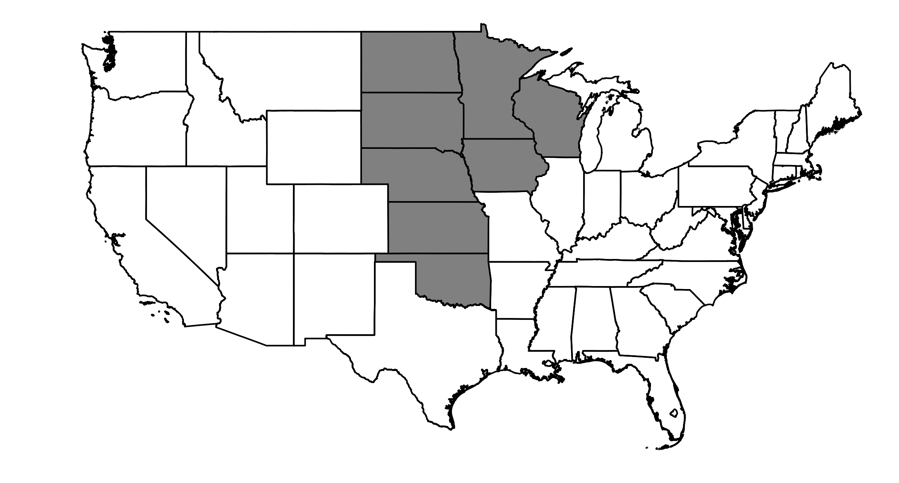

###############
NERC Region MRO
###############

Map of NERC Region MRO
======================

Note that we used a simple state mask, and the region may not perfectly match the spatial boundary of the true NERC region.

GCM Historical Skill Summary (1980-2019)
========================================

.. raw:: html
   :file: ../_static/skill_tables/skill_mro.html

|
|

GCM Changes from 1980-2019 to 2050-2059
=======================================
All of the following plots are interactive. Try hovering your mouse over data points, clicking and dragging, scrolling, and double clicking on the legends.

.. raw:: html
   :file: ../_static/scatter_plots/mro_scatter_ssp245.html
.. raw:: html
   :file: ../_static/scatter_plots/mro_scatter_ssp370.html
.. raw:: html
   :file: ../_static/scatter_plots/mro_scatter_ssp585.html

|

Change in Temperature
=====================

.. raw:: html
   :file: ../_static/trend_plots/mro_t2m.html

|

Daily Maximum Temperature Events
================================

.. raw:: html
   :file: ../_static/trend_plots/mro_t2m_max.html

|

Daily Minimum Temperature Events
================================

.. raw:: html
   :file: ../_static/trend_plots/mro_t2m_min.html

|

Change in Relative Humidity
===========================

.. raw:: html
   :file: ../_static/trend_plots/mro_rh.html

|

Change in Precipitation
=======================

.. raw:: html
   :file: ../_static/trend_plots/mro_pr.html

|

Annual Minimum Precipitation Events
===================================

.. raw:: html
   :file: ../_static/trend_plots/mro_pr_min.html

|

Change in Windspeed
===================

.. raw:: html
   :file: ../_static/trend_plots/mro_ws100m.html

|

Change in Global Horizontal Irradiance
======================================

.. raw:: html
   :file: ../_static/trend_plots/mro_ghi.html
