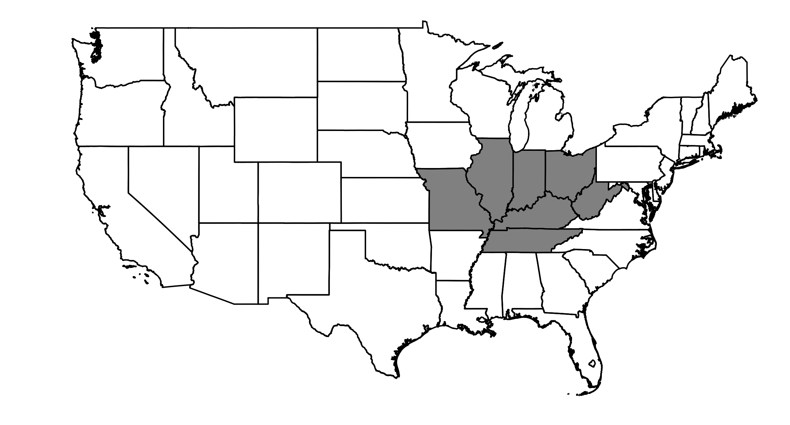

#######################
NOAA Region Ohio Valley
#######################

Map of NOAA Region Ohio Valley
==============================

GCM Historical Skill Summary (1980-2019)
========================================

.. raw:: html
   :file: ../_static/skill_tables/skill_ohio_valley.html

|
|

GCM Changes from 1980-2019 to 2050-2059
=======================================
All of the plots after the skill table are interactive. Try hovering your mouse over data points, clicking and dragging, scrolling, and double clicking on the legends.

.. raw:: html
   :file: ../_static/scatter_plots/ohio_valley_scatter_ssp245.html
.. raw:: html
   :file: ../_static/scatter_plots/ohio_valley_scatter_ssp370.html
.. raw:: html
   :file: ../_static/scatter_plots/ohio_valley_scatter_ssp585.html

|

Change in Temperature
=====================

.. raw:: html
   :file: ../_static/trend_plots/ohio_valley_t2m.html

|

Daily Max Temperature
=====================

.. raw:: html
   :file: ../_static/trend_plots/ohio_valley_t2m_max.html

|

Daily Min Temperature
=====================

.. raw:: html
   :file: ../_static/trend_plots/ohio_valley_t2m_min.html

|

Change in Relative Humidity
===========================

.. raw:: html
   :file: ../_static/trend_plots/ohio_valley_rh.html

|

Change in Precipitation
=======================

.. raw:: html
   :file: ../_static/trend_plots/ohio_valley_pr.html

|

Change in Windspeed
===================

.. raw:: html
   :file: ../_static/trend_plots/ohio_valley_ws100m.html

|

Change in Global Horizontal Irradiance
======================================

.. raw:: html
   :file: ../_static/trend_plots/ohio_valley_ghi.html
