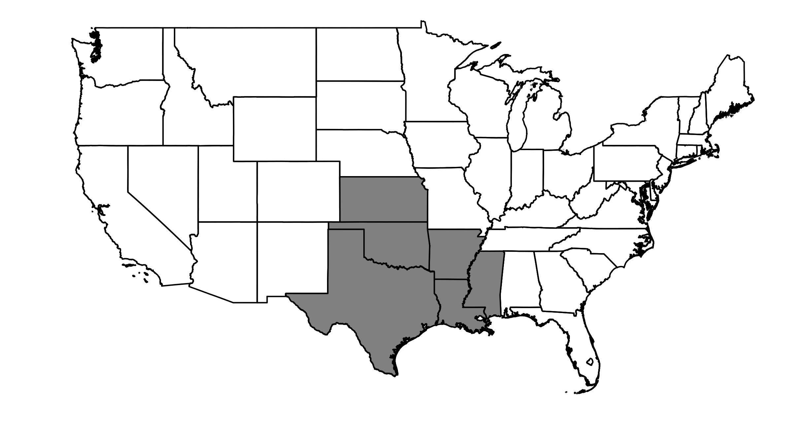

#################
NOAA Region South
#################

Map of NOAA Region South
========================

GCM Historical Skill Summary
============================

.. raw:: html
   :file: ../_static/skill_tables/skill_south.html

Change in Temperature (Celsius)
===============================

.. raw:: html
   :file: ../_static/trend_plots/south_t2m.html

Change in Temperature (Fahrenheit)
==================================

.. raw:: html
   :file: ../_static/trend_plots/south_t2m_degf.html

Daily Max Temperature (Celsius)
===============================

.. raw:: html
   :file: ../_static/trend_plots/south_t2m_max.html

Daily Max Temperature (Fahrenheit)
==================================

.. raw:: html
   :file: ../_static/trend_plots/south_t2m_max_degf.html

Daily Min Temperature (Celsius)
===============================

.. raw:: html
   :file: ../_static/trend_plots/south_t2m_min.html

Daily Min Temperature (Fahrenheit)
==================================

.. raw:: html
   :file: ../_static/trend_plots/south_t2m_min_degf.html

Change in Relative Humidity
===========================

.. raw:: html
   :file: ../_static/trend_plots/south_rh.html

Change in Precipitation
=======================

.. raw:: html
   :file: ../_static/trend_plots/south_pr.html

Change in Windspeed
===================

.. raw:: html
   :file: ../_static/trend_plots/south_ws100m.html

Change in Global Horizontal Irradiance
======================================

.. raw:: html
   :file: ../_static/trend_plots/south_ghi.html
