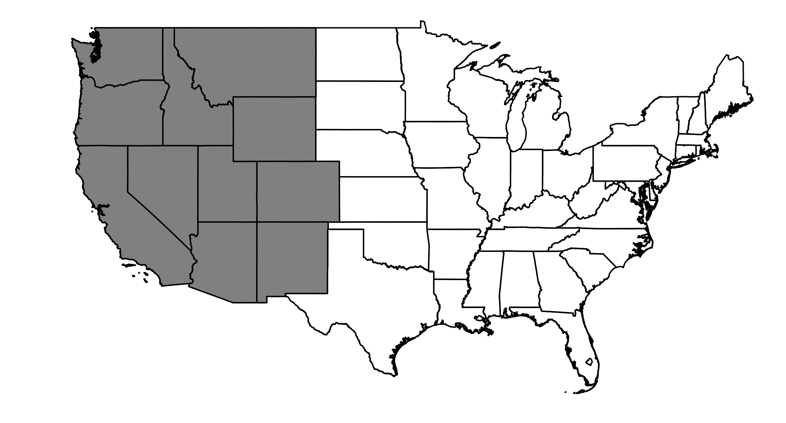

################
NERC Region WECC
################

Map of NERC Region WECC
=======================

GCM Historical Skill Summary
============================

.. raw:: html
   :file: ../_static/skill_tables/skill_wecc.html

|
|

GCM Changes from 1980-2019 to 2050-2059
=======================================
.. raw:: html
   :file: ../_static/scatter_plots/wecc_scatter_ssp245.html
.. raw:: html
   :file: ../_static/scatter_plots/wecc_scatter_ssp585.html

|

Change in Temperature (Celsius)
===============================

.. raw:: html
   :file: ../_static/trend_plots/wecc_t2m.html

|

Change in Temperature (Fahrenheit)
==================================

.. raw:: html
   :file: ../_static/trend_plots/wecc_t2m_degf.html

|

Daily Max Temperature (Celsius)
===============================

.. raw:: html
   :file: ../_static/trend_plots/wecc_t2m_max.html

|

Daily Max Temperature (Fahrenheit)
==================================

.. raw:: html
   :file: ../_static/trend_plots/wecc_t2m_max_degf.html

|

Daily Min Temperature (Celsius)
===============================

.. raw:: html
   :file: ../_static/trend_plots/wecc_t2m_min.html

|

Daily Min Temperature (Fahrenheit)
==================================

.. raw:: html
   :file: ../_static/trend_plots/wecc_t2m_min_degf.html

|

Change in Relative Humidity
===========================

.. raw:: html
   :file: ../_static/trend_plots/wecc_rh.html

|

Change in Precipitation
=======================

.. raw:: html
   :file: ../_static/trend_plots/wecc_pr.html

|

Change in Windspeed
===================

.. raw:: html
   :file: ../_static/trend_plots/wecc_ws100m.html

|

Change in Global Horizontal Irradiance
======================================

.. raw:: html
   :file: ../_static/trend_plots/wecc_ghi.html
